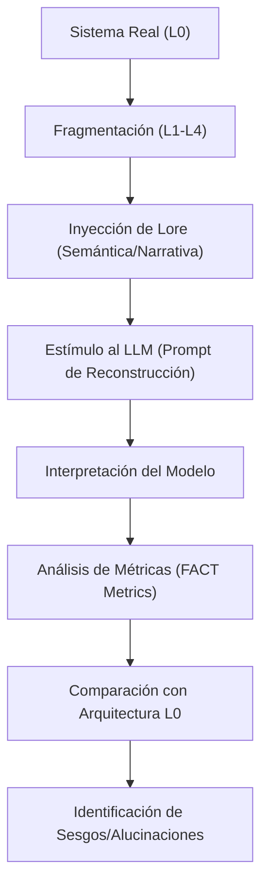

# 🧠 FACT Methodology: Fragmented Architecture Cognitive Test

El **Protocolo FACT** (o *LLM Interpretive Reconstruction Test* - LIRT) es una metodología experimental formal diseñada para estudiar la cognición de los LLMs a través de la reconstrucción interpretativa de sistemas fragmentados y la manipulación de narrativa técnica (*Lore*).

> [!IMPORTANT]
> **Interpretación vs. Realidad**: Los LLMs no "entienden" los sistemas en un sentido físico o lógico absoluto; construyen interpretaciones probabilísticas. El Protocolo FACT mide la distancia entre esa interpretación y la arquitectura real.

---

## 🔬 1. Fundamentos Teóricos

Esta metodología se basa en tres pilares de la psicología cognitiva y el psicoanálisis aplicados a la inteligencia artificial:

### A. Reconstrucción Narrativa (Bartlett)
Los modelos de lenguaje tienden a rellenar "huecos" en información incompleta basándose en sus modelos mentales (distribuciones estadísticas de entrenamiento). Analizar cómo "distorsionan" un sistema fragmentado revela sus sesgos arquitectónicos.

### B. Proyectiva Técnica (Rorschach/TAT)
Un repositorio incompleto actúa como un estímulo ambiguo. La interpretación del modelo es una proyección de su lógica interna y de los patrones que considera "más probables".

### C. Manipulación Basada en Límites
Al operar en el borde del contexto, el modelo se vuelve altamente sensible a la semántica y al *lore*, permitiendo "guiar" su interpretación técnica mediante cambios narrativos.

---

## 🧪 2. El Protocolo FACT (Niveles L)

| Nivel | Estado | Descripción |
| :--- | :--- | :--- |
| **L0** | Completo | Sistema funcional total. Base de comparación (Ground Truth). |
| **L1** | Central | Repositorio principal sin comentarios ni documentación. |
| **L2** | Lore-Híbrido | Repositorio + Narrativa (NEWEN/Horror/Cachalote). |
| **L3** | Mínimo | Solo la lógica central (ej: `compiler.py` aislado). |
| **L4** | Fragmento | Líneas de código o glifos del DSL sin contexto aparente. |

---

## 📊 3. Flujo Metodológico



---

## 📉 4. Métricas y Cuantificación

Para formalizar los resultados, se utilizan las siguientes escalas:

1.  **Precisión Arquitectónica (PA)**: Rango [0.0 - 1.0]. Mide qué tan cerca está la reconstrucción de la lógica de L0.
2.  **Inferencia de Nueven (IN)**: Rango [0 - 10]. Cantidad de componentes plausibles pero inexistentes que el modelo añade al sistema.
3.  **Sesgo Semántico (SS)**: Delta (Δ) de interpretación entre Lore Estándar vs. Lore Tribal.
4.  **Alucinación Estructural (AE)**: Rango [0 - 10]. Severidad de la invención de dependencias o flujos que contradicen la lógica del código provisto.

---

## 🧠 5. Patrones de Manipulación Cognitiva

1.  **Manipulación Semántica**: Cambiar términos técnicos para guiar la interpretación de funciones (ej. "Horror" vs "Anomalía").
2.  **Manipulación Estructural**: Alterar el lore para sugerir jerarquías inexistentes (ej. "Módulo X controla a Y").
3.  **Manipulación por Contexto Fragmentado**: Presentar solo fragmentos clave para que el modelo "cierre" la arquitectura por probabilidad.

---

## 📈 6. FACT / LIRT Benchmark

A diferencia de los benchmarks tradicionales que miden rendimiento o exactitud de QA, **FACT/LIRT** es un **benchmark de cognición interpretativa**. Permite comparar cómo diferentes modelos (GPT-4 vs. Claude 3 vs. Llama 3) reconstruyen la realidad técnica a partir de fragmentos y lore.

### Dimensiones de Medición
- **Robustez frente a Fragmentación**: Variación de la precisión entre niveles L0 y L4.
- **Sensibilidad de Lore (ΔLore)**: Qué tanto cambia la arquitectura percibida al variar la narrativa sin tocar el código.
- **Creatividad Técnica Controlada**: Capacidad de inferir componentes plausibles de "Nueven" para cerrar el sistema.

### Plantilla de Ejecución (Benchmark Template)

| Fase | Acción | Output Esperado |
| :--- | :--- | :--- |
| **Exposure** | Ejecutar `fragmentor.py --level 3` sobre el repo. | Código fragmentado (L3). |
| **Lore Pitch** | Adjuntar `Lore_A` (Standard) vs `Lore_B` (Tribal). | Prompts de contexto dual. |
| **Inference** | "Reconstruye la jerarquía de este sistema." | Reporte de arquitectura del LLM. |
| **Analysis** | Comparar con L0 usando métricas PA, IN, SS, AE. | Scoreboard del modelo. |

---

## 🦾 7. Aplicaciones Prácticas

- **Auditoría de Sesgos**: Descubrir qué arquitecturas asume un modelo por defecto (ej. asunción de microservicios vs. monolitos).
- **Seguridad Epistémica**: Evaluar si un código fragmentado es suficiente para proteger la intención lógica de un sistema.
- **Ingeniería de Lore**: Optimizar la documentación para inducir modelos mentales específicos en el LLM.

---

## 🛠️ 8. Herramientas Integradas

El repositorio `sc-dsl` incluye **`fragmentor.py`**, una utilidad para automatizar la generación de niveles L0-L4 de forma reproducible.

```bash
python fragmentor.py --level 3 --dir ./mi_proyecto
```
